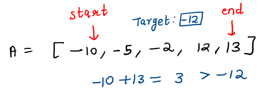
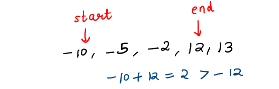
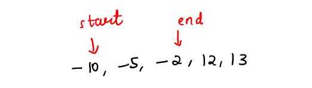

# 3Sum

## Problem Statement
Given an array of **nums** of **n** integers, are there elements *a*, *b*, *c* in **nums** such that *a + b + c = 0*? Find all unique triplets in the array which gives the sum of zero.

### Note
The solution set must not contain duplicate triplets.

### Example
Given array `nums = [-1, 0, 1, 2, -1, -4]`,

A solution set is:

`[
  [-1, 0, 1],
  [-1, -1, 2]
]`

## Solution Approach 1 - Brute Force (Time Limit Exceeded)
Consider all possible triplets using 3 nested loops, and if the sum of the triplet equals 0, add it to a set of vector (after sorting those 3 numbers). This will make sure that the final result doesn't contain any duplicate triplets.

### Time Complexity
This solution takes a time complexity of `O(N^3 log N)` since insertion in the set will take `O(log N)` time.

## Solution Approach 2 - Two Pointers
### Intuition
Let's say we fixed one of the numbers in the triplets as `x` and other numbers be `y` and `z`. 
Thus,
`y + z = -x`.

If we had sorted the elements in the given array, we can easily find a pair with given sum value using a `two-pointer` approach.

We maintain one `start` pointer at the beginning of the array, and an `end` pointer at the end of the array.

Considering the sum of values at these 2 positions:

- Less than the `target`: Shift the `start` pointer to right.
- Greater than the `target`: Shift the `end` pointer to the left.
- Equals the `target`: Congrats! You've found the pair.

Let us understand the 2-pointer approach to find pair with given sum. Consider the given array (sorted) as 

`A = [-10, -5, -2, 12, 13]`

and you need to find a pair with sum = -12.



Initially, sum = 3 which is more than -12, thus shifting the end pointer to left.



Again, shifting the end pointer to the left.



Finally, you get a pair with sum = target.

We still need to make sure that we do not get duplicate triplets, and we do not miss one!

## Algorithm
Let's take an example to develop the algorithm.

`A = [-2, -2, -1, -1, 0, 1, 1, 2, 2]`

Let's say we were to consider first -2 as fixed. Now, we need to find pairs with sum = 2 in the remaining array. <br/>
i.e. pairs with **target = 2** in `A' = [-2, -1, -1, 0, 1, 1, 2, 2]`

To find multiple pairs, we can do the following modification:
<br/>
Whenever pair sum = target, shift both start and end pointers to right and left respectively.
So, we will get `(0, 2)` and `(1, 1)` as the required pairs and hence `(-2, 0, 2)` and `(-2, 1, 1)` as the corresponding triplets.

Now, considering the next `-2` in the array, can we simply ignore the left part of the array?
<br/>
Exactly, because we already found all possible pairs taking elements in the left part as fixed.
<br/>
So, for the second `-2` in the array, the array to look is just to the right of it, i.e. `A' = [-1, -1, 0, 1, 1, 2, 2]`.

But, now how do we ensure that no duplicate triplets are present in the result?
<br/>
If we use an additional set to store the results, it will be require additional space, as well as insertion would take `O(log N)`. Can we do it more **efficiently**?

Let's consider another example: <br/>
`B = [-2, -2, -2, 1, 1, 4, 4]`

- So, let's start with the `-2` at index `0`.
  - Let's find all pairs with sum `2`.
  - They come out to be `(-2, 4), (-2, 4), (1, 1)`. 
  - At each step, we shift both the `start` and `end` pointers since sum exactly matches target.

    Could we have avoided the duplicate `(-2, 4)` getting in our way? YES. <br/>
    See that we can simply move the `start` pointer while it matches its old value (-2) and similarly shift the `end` pointer till it matches its old value (4).

- Now, let's come to the `-2` at index `1`.
    - As per our approach, we will see to its right to get pairs with sum `2`.
    - But, we have already considered all possible pairs with `sum = 2` for the previous `-2`.
    - So, we can simply ignore this element for further processing to avoid duplicates.

From this example, we have found out a way to avoid duplicates.

- We can simply move our first element of triplet to the right till it matches the previous number.
- While finding the pair with sum equal to negation of fixed element, we can shift the start/end pointers till they refer to the same values (old start/end).

### Time Complexity
- First of all, array is sorted incurring `O(n log n)`.
- We are then fixing the first element of the triplet in the outer loop running over all the elements. 
- In the inner loop, we find a pair with sum equals negation of number fixed in outer loop, using two-pointer approach and avoiding duplicates smartly.

Thus, overall time complexity = `O(nlogn + n*n)` = `O(n^2)`

### Implementation

#### C++ Code
```c++
class Solution {
public:
    vector<vector<int>> threeSum(vector<int>& nums) {
      vector<vector<int>> res;
      
      // size of the array nums
      int total = nums.size(); 
      
      // sort the numbers
      sort(nums.begin(), nums.end());
      
      // fix the first number of the triplet
      for (int firstNumIdx = 0; firstNumIdx < total; ++firstNumIdx) {
        int firstNum = nums[firstNumIdx];
        // find pairs with sum = -firstNum in the right
        int start = firstNumIdx + 1;
        int end = total - 1;
        while (start < end) {
          // consider the current pair sum
          int current = nums[start] + nums[end];
          if (current < -firstNum) {
            // shift the start pointer to the right
            ++start;
          } else if (current > -firstNum) {
            // shift the end pointer to the left
            --end;
          } else {
            // add to the result
            res.push_back({firstNum, nums[start], nums[end]});
            int oldStart = start;
            int oldEnd = end;
            // shift the start till it matches the old value
            while (start < end && nums[start] == nums[oldStart]) {
              ++start;
            }
            // shift the end till it matches the old value
            while (end > start && nums[end] == nums[oldEnd]) {
              --end;
            }
            // the above two while loops ensure that both start/end
            // get shifted atleast once
          }
          // avoid duplicates
          while (firstNumIdx + 1 < total 
                 && nums[firstNumIdx + 1] == nums[firstNumIdx]) {
            ++firstNumIdx;
          }
        }
      }
      
      return res;
    }
};
```