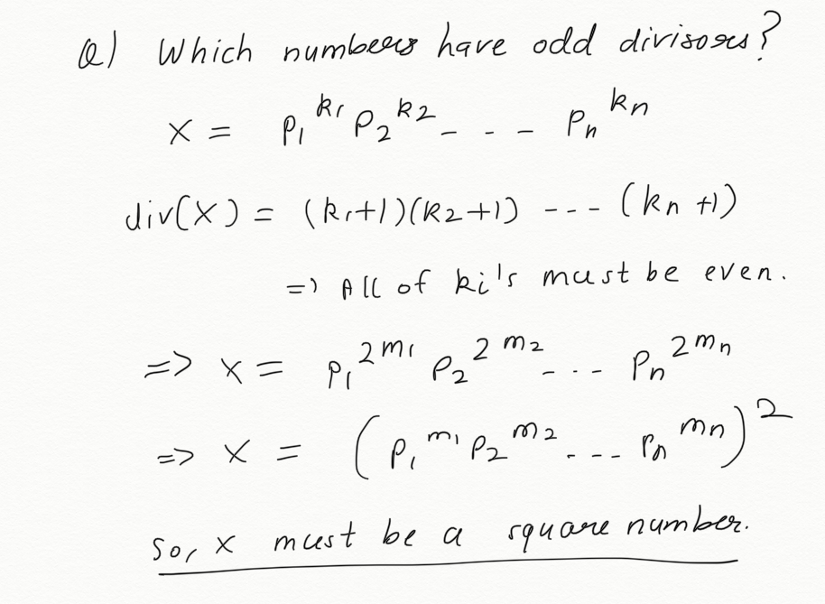

# Solution

First of all, which numbers have odd divisors?

It turns out that only perfect square numbers have an odd count of divisors, like 1, 4, 9 ...

Now, we need to change a number with minimum steps to turn it into a perfect square number.
So, we can find distance of number from two of its nearest perfect square numbers. Think about it!

Thus, second query reduces to finding the sum of minimum steps for all elements in [L, R].

We can store the steps required for each element in an array named `steps`.
We just need to perform range sum query now. But, there are also update queries.
So, the brute force solution with O(1) update and O(N) query is not optimal.

We can use segment tree to perform O(log N) update and O(log N) Range Sum Query.